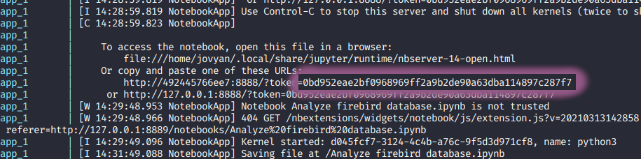

# Analisando banco de dados firebird com pandas 
_É preciso ter instalado na sua maquina o docker e o docker-compose._

## Clonando o repositório
```sh
git clone https://github.com/cilas/python-firebird
cd python-firebird
```
## Subindo os containers
```sh
docker-compose up -d
```
## Acessando Jupyter notebook
Se os containers subiram sem erros, vocẽ pode acessar o jupyter notebook
através do endereço:
```http
http://localhost:8889
```
Quando abrir a página, o jupyter irá solicitar o token para login. 
Desta forma, você pode pega-lo acessando o log do container `app`
```sh
docker-compose logs app
```
Você pode visualiza-lo conforme imagem abaixo  


## Acessando modo interativo do firebird
Caso você queira executar algumas consultas direto pelo firebird, use o `isql`.  
Entrando no container do firebird server
```sh
docker-compose exec firebird sh
```
Iniciando o utilitário
```sh
./usr/local/firebird/bin/isql
```
Conectando a base de dados
```sh
CONNECT "/firebird/data/examples.fdb" user 'SYSDBA' password 'masterkey';
```
Exibindo as tabelas
```sh
show tables;
```